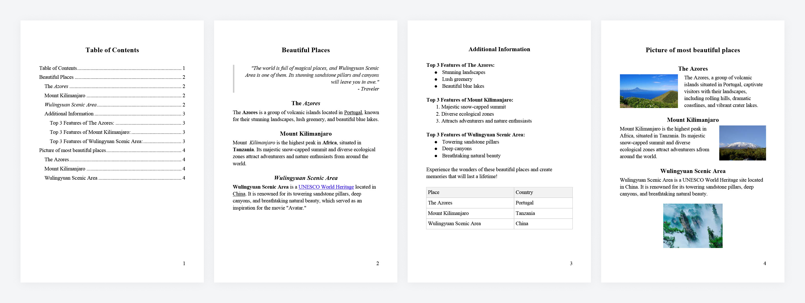

# beautiful-docx

[![NPM Version][npm-image]][npm-url]

Easily generate .docx files with HTML and CSS.


`beautiful-docx` is a wrapper around [`docx`](https://www.npmjs.com/package/docx) library that allows you to create beautiful .docx documents using HTML and CSS (inline styles) instead of JS objects.

This library is different from other available HTML to DOCX converters because of the following features (among others):

- table of content generation
- page numbering
- custom page sizes and margins
- paragraph first line indentation
- automatic or manual images downloading
- table and image sizing and positioning

The library is writted with TypeScript and is fully covered with unit tests.

`beautiful-docx` is created and maintained by [Flexum](https://flexum.io). PRs are welcome. Contact us at [opensource@flexum.io](mailto:opensource@flexum.io).

## Example

Here's an [example](./example/exampleText.ts) of an HTML document that allows you to generate to following file (utilizing these [parameters](./example/example.ts)):

[](./example/example.png)

## Allowed HTML elements

**Supported**: a, article, blockquote, br, caption, col, colgroup, div, figure, h1-h6, i, img, li, ol, p, s, section, strong, table, tbody, td, tfoot, th, tr, u, ul, em, span, sub, sup, b, pre, aside, html, body, main, header, footer, nav

**Custom elements:** page-break, table-of-contents

**Unsupported:** abbr, address, cite, code, dd, del, din, dl, dt, figcaption, hr, ins, kbd, mark, picture, q, small, time

## Installation

```bash
npm install beautiful-docx
```

## Usage

Start with creating a converter instance. You may pass options object as an argument.

The converter exposes a `generateDocx` method that receives an HTML string and returns a buffer containing the final document.

```tsx
import { DocxGenerator } from 'beautiful-docx';
import * as fs from 'fs';

const html = `
<div>
  <p>Example</p>
</div>
`;

const DocxGenerator = new DocxGenerator({
  page: {
    size: {
      width: 5.5,
      height: 8,
    },
  },
});

const buffer = await DocxGenerator.generateDocx(html);

fs.writeFileSync('example.docx', buffer);
```

### Options (`docxExportOptions?: DeepPartial<DocxExportOptions>`)

Options is an object with the following fields.

#### `page: PageOptions`

Sets document page settings.

- `orientation: PageOrientation`

  Page orientation.

  **Available values**: `'portrait'`, `'landscape'`

  **Default**: `'portrait'`

  **Example**:

  ```tsx
  import { PageOrientation } from 'beautiful-docx';

  const options = {
    page: {
      orientation: PageOrientation.Portrait,
    },
  };
  ```

- `size: PageSize`

  Page width and height in inches.

  - `width: number`

  - `height: number`

    You can use ready-made page sizes - `PageFormat`

    **Available values**: `A3, A4, A5, A6`;

    **Default:** `A4` (8.3’x11.7’)

    **Example**:

    ```tsx
    import { PageFormat } from 'beautiful-docx';

    const options = {
      page: {
        sizes: PageFormat.A4,
      },
    };
    ```

    ```tsx
    const options = {
      page: {
        sizes: {
          width: 8.3,
          height: 11.7,
        },
      },
    };
    ```

- `margins: object`

  Page margins in millimeters.

  - `top: number`

    **Default:** 25.4

  - `left: number`

    **Default:** 25.4

  - `bottom: number`

    **Default:** 25.4

  - `right: number`

    **Default:** 25.4

  **Example:**

  ```tsx
  const options = {
    page: {
      margins: {
        top: 25,
        left: 25,
        right: 20,
        bottom: 25,
      },
    },
  };
  ```

- `numbering: false | NumberingOptions`

  Responsible for displaying page numbering.

  - `start: number`

    **Default:** `1`

  - `type: NumberFormat`

    **Default:** `NumberFormat.DECIMAL`

  - `align: AlignmentType`

    **Default:** `AlignmentType.CENTER`

  **Example:**

  ```tsx
  const options = {
    page: {
      numbering: {
        type: NumberFormat.LOWER_LETTER,
        align: AlignmentType.END,
      },
    },
  };
  ```

#### `font: FontOptions`

Configuration of font sizes and font-family.

- `baseSize: number`

  Base text font size in points.

  **Default:** `12`

  **Example:**

  ```tsx
  const options = {
    font: {
      baseSize: 11,
    },
  };
  ```

- `headersSizes: object`
  Header font sizes of different levels

  - `h1: number`

    **Default:** `19.5`

  - `h2: number`

    **Default:** `16.5`

  - `h3: number`

    **Default:** `15`

  - `h4: number`

    **Default:** `13.5`

  - `h5: number`

    **Default:** `12`

  - `h6: number`

    **Default:** `10.5`

  **Example:**

  ```tsx
  const options = {
    font: {
      headersSizes: {
        h1: 22,
        h2: 20,
        h3: 18,
        h4: 16,
      },
    },
  };
  ```

- `baseFontFamily: string`

  Font family for base text

  **Available values**: any Microsoft Office Word font.

  **Default**: `'Arial'`

  **Example:**

  ```tsx
  const options = {
    font: {
      baseFontFamily: 'Times New Roman',
    },
  };
  ```

- `headersFontFamily: string`

  Font family for headers.

  **Available values**: any Microsoft Office Word font.

  **Default**: `'Arial'`

  **Example:**

  ```tsx
  const options = {
    font: {
      headersFontFamily: 'Times New Roman',
    },
  };
  ```

#### `table: TableOptions`

Properties of tables.

- `cellPaddings: object`

  Table cell paddings configuration in pixels

  - `top: number`

    **Default:** `5`

  - `left: number`

    **Default:** `5`

  - `right: number`

    **Default:** `5`

  - `bottom: number`

    **Default:** `5`

  **Example:**

  ```tsx
  const options = {
    table: {
      cellPaddings: {
        top: 10,
        left: 15,
      },
    },
  };
  ```

#### `images: ImageMap | undefined`

The `images` parameter allows you to preload the images used in the `html`.

This is an object in which the `urls` of the images are the keys, and the `Buffer` with the image is the value.

If you do not pass the `images` parameter, the images will be automatically loaded from the `src` attributes of the `img` tags.

**Example:**

```tsx
const imageSourceUrl = 'https://example.com/image.png';
const html = `

`;

const res = await axios.get(imageSourceUrl, { responseType: 'arraybuffer' });
const imageBuffer = Buffer.from(res.data, 'binary');

const options = {
  images: {
    [imageSourceUrl]: imageBuffer,
  },
};
```

#### `verticalSpaces: number`

Vertical indents between lines ratio.

**Default:** `1`

**Example:**

```tsx
const options: {
  verticalSpaces: 1.15;
};
```

#### `ignoreIndentation: boolean`

If `false`, adds an indent for the first line of the paragraph.

Indentation is ignored for the first paragraph in a block.

**Default:** `true`

**Example:**

```tsx
const options: {
  textIndentation: false;
};
```

### Supported types of top-level content

The `beautiful-docx` library supports various types of `html` input content.

#### Plain text

Will be reformatted into a paragraph with appropriate content.

**Example:**

```tsx
const html = 'Some plain text'; // transforms to: <p>Some plain text</p>
```

#### Inline elements

The library supports the following inline elements: `'strong', 'i', 'u', 's', 'br'`.

Each inline element on the top level will be wrapped with `<p>`, for example:

**Example:**

```tsx
const html = `
<strong>strong</strong>
<i>italic</i>
`;
// transforms to:
// <p><strong>strong</strong></p>
// <p><i>italic</i></p>
```

To avoid this you should keep inline elements within block elements.

#### Block elements-containers

The library allows the following container elements: `'div', 'article', 'section', 'html', 'body', 'aside', 'main', 'header', 'aside', 'footer', 'nav', 'pre'`.

The library effectively ignores these elements and treats the inner content as a top-level content.

**Example:**

```tsx
const html = `
<div>plain text</div>
<section><p>paragraph</p></section>
`;
// transforms to:
// <p>plain text</p>
// <p>paragraph</p>
```

#### Block elements

The library supports the following block elements: `'p', 'h1', 'h2', 'h3', 'h4', 'ul', 'ol', 'figure', 'blockquote', 'table', 'img'`.

Block elements cannot be nested in other block elements, except for the cases provided for in the exceptions (see the description for each specific element).

**Example:**

```tsx
const html = `
  <h1>H1 Example</h1>
  <h2>H2 Example</h2>
  <h3>H3 Example</h3>
  <h4>H4 Example</h4>
  <p>paragraph with <i>italic</i> text</p>
  <ol>
    <li>List Item</li>
    <li>List Item</li>
    <li>List Item</li>
  </ol>
`;
```

#### Custom elements

Supported custom elements: `page-break`, `table-of-contents`.

Custom elements are used to insert additional content.

### Supported element specs

#### `div, article, section`

Container elements.

**Can be nested in:**

- document root
- other container element

**Supported content:**

- root content

**Attributes**: not supported

**Inline-styles**: not supported

**Example:**

```tsx
const html = `
<section>
  <article>
    <div>
      <p>Paragraph</p>
    </div>
  </article>
</section>
`;
```

#### `p`

Converts to a paragraph with text.

**Can be nested in:**

- document root
- container element
- `li` (known issue: displayed with a new line)
- `blockquote`
- `caption`
- `td`

**Supported content:**

- plain text
- inline-tags
- `img`

**Attributes**: not supported

**Inline-styles**:

- `text-align` - horizontal text position

  **Available values:** `justify`, `left`, `center`, `right`

  **Default**: `left`

**Extra:**

By default, `text-indent` is added for paragraphs (except the first paragraph in each block). This can be disabled by passing `ignoreIndentation: true`.

If necessary, you can add vertical indents between paragraphs. For this, you need to pass the parameter `verticalSpaces`.

**Example**:

```tsx
const html = `
<p style='text-align: center'>Paragraph 1</p>
<p>Paragraph 2</p>
<ul>
  <li>
    <p>List item</p>
  </li>
</ul>
`;
```

#### `h1-h6`

Block elements. They are converted into headings of the appropriate level. Participate in `table-of-contents` formation.

**Can be nested in:**

- document root
- container element
- `li` (partial support - displayed from a new line)
- `caption`
- `td`

**Supported content:**

- plain text
- inline elements
- `img`

**Attributes**: not supported

**Inline-styles**:

- `text-align` - horizontal text position

  **Available values:** `justify`, `left`, `center`, `right`

  **Default**: `left`

**Extra:**

For headings, you can set the `font size` and `font-family`. To do this, you need to pass the appropriate parameters: `font.headersSizes`, `font.headersFontFamily`.

**Example**:

```tsx
const html = `
  <h1 style='text-align: center'>Page Title</h1>
  <h2><i>Page subtitle</i></h2>
`;
```

#### `ul, ol`

Block elements. Convert to lists.

**Can be nested in:**

- document root
- container element
- `li` - are displayed as lower-level lists
- `caption`
- `td`

**Supported content:**

- `li`
- plain text - not recommended. Displayed from a new line as a paragraph

**Attributes**: not supported

**Inline-styles**: not supported

**Example:**

```tsx
const html = `
<ul>
  <li>List item
      <ol>
        <li>List Item</li>
        <li>List Item</li>
        <li>List Item</li>
      </ol>
  </li>
  <li>List item</li>
<ul>
`;
```

#### `li`

Block element. Displayed as a list item.

**Can be nested in:**

- `ul`

**Supported content:**

- plain text - displayed as a list item
- root content - is displayed from a new line as plain text
- `ul` - nested list

**Attributes**: not supported

**Inline-styles**:

- `text-align` - horizontal text position

  **Available values:** `justify`, `left`, `center`, `right`

  **Default**: `left`

**Example:**

```tsx
const html = `
<ul>
  <li>List item
      <ol>
        <li>List Item</li>
        <li>List Item</li>
        <li>List Item</li>
      </ol>
  </li>
  <li>List item</li>
<ul>
`;
```

#### `figure`

Block element.

**Can be nested in:**

- document root
- container element
- `li`
- `caption`
- `td`

**Supported content:**

- `img`
- `table`

**Attributes**: not supported

**Inline-styles**: not supported

**Example:**

```tsx
const html = `
<figure>
  
</figure>
<figure>
  <table>
    <tbody>
      <tr>
        <td>Example</td>
      </tr>
    </tbody>
  </table>
</figure>
`;
```

#### `img`

Inline-block element. Responsible for displaying images.

**Can be nested in:**

- document root
- container element
- `li`
- `caption`
- `td`
- `figure`

**Supported content:** not supported

**Attributes**:

- `src`

  URL to download the image.

**Inline-styles**:

- `float`

  Necessary for horizontal image positioning. Without an attribute - the image will be located in the center of the page

  **Available values:** `left, right, center`

  **Default:** `center`

- `width`

  Image width.
  Available units - `%, px, vw`

  If you do not specify the width, it will be automatically calculated from the initial dimensions of the image.
  If the width of the image is greater than the dimensions of the page - the image will be displayed on the entire width of the page.

  If you set the width in `%` or `vw` - the width will be calculated based on the page size.

  If you set the width in `px` - the width of the image will be equal to the value, but not more than the width of the page.
  Image height is calculated automatically based on image width and aspect ratio.

**Extra:**

Image orientation is calculated automatically based on file metadata.

Images for insertion can be preloaded (if they are found locally on the device or server). To do this, you need to download the image as a buffer and insert it into the `images` options parameter.

If a paragraph is found after the image, the image will be "linked" to this paragraph. If there is no paragraph after the image, it will be created automatically.

**Example:**

```tsx
const url = 'https://example.com/image.png';
const html = `
<figure>
  
</figure>

	
`;
```

#### `blockquote`

Block element. Displayed as italic text with left border.

**Can be nested in:**

- document root
- container element
- `li` (partial support - displayed from a new line)
- `caption`
- `td`

**Supported content:**

- plain text
- root content - is displayed from a new line as plain text

**Attributes**: not supported

**Inline-styles**:

- `text-align` - horizontal text position

  **Available values:** `justify`, `left`, `center`, `right`

  **Default**: `left`

**Example:**

```tsx
const html = `
<blockquote>
  Premature Optimization Is the Root of All Evil
<blockquote>
`;
```

#### `table`

Block element. Responsible for displaying tables.

**Can be nested in:**

- document root
- container element
- `li`
- `td`
- `figure`

**Supported content:**

- `thead`
- `tr`
- `tfoot`
- `tr`
- `colgroup`
- `caption`

**Attributes**: not supported

**Inline-styles**:

- `width`

  Supported units: `%`, `px`, `pt`, `vw`, `auto`, `em`, `rem`

  Without the attribute or with `auto` value - the table will stretch to the entire width of the page

  `vh` value ignored.

  `em`, `rem` sets table width relative to `options.font.baseSize` value

**Example:**

```tsx
const html = `
<table>
  <caption>Table</caption>
  <colgroup>
    <col style="width:30%;">
    <col style="width:70%;">
  </colgroup>
  <tbody>
    <tr>
  	  <td>First</td>
  	  <td>Second</td>
    </tr>
    <tr>
  	  <td>First</td>
  	  <td>Second</td>
    </tr>
  </tbody>
</table>
`;
```

#### `caption`

Block element. Responsible for displaying the table header.

**Can be nested in:**

- `table`

**Supported content:**

- root-content (except table)

**Attributes**: not supported

**Inline-styles**: not supported

**Example:**

```tsx
const html = `
<table>
  <caption>Table</caption>
  <tbody>
    <tr>
      <td>Cell</td>
    </tr>
  </tbody>
</table>
`;
```

#### `thead`

Responsible for displaying rows of the table with a header.

**Can be nested in:**

- `table`

**Supported content:**

- `tr`

**Attributes**: not supported

**Inline-styles**: not supported

**Example:**

```tsx
const html = `
<table>
  <thead>
    <tr>
      <td>Cell</td>
    </tr>
  </thead>
</table>
`;
```

#### `tbody`

Responsible for displaying the body of the table.

**Can be nested in:**

- `table`

**Supported content:**

- `tr`

**Attributes**: not supported

**Inline-styles**: not supported

**Example:**

```tsx
const html = `
<table>
  <tbody>
    <tr>
      <td>Cell</td>
    </tr>
  </tbody>
</table>
`;
```

#### `tfoot`

Responsible for displaying the footer of the table.

**Can be nested in:**

- `table`

**Supported content:**

- `tr`

**Attributes**: not supported

**Inline-styles**: not supported

**Example:**

```tsx
const html = `
<table>
  <tfoot>
    <tr>
      <td>Cell</td>
    </tr>
  </tfoot>
</table>
`;
```

#### `tr`

Responsible for displaying table rows.

**Can be nested in:**

- `table`
- `tbody`
- `thead`
- `tfoot`

**Supported content:**

- `td`
- `th`

**Attributes**: not supported

**Inline-styles**: not supported

**Example:**

```tsx
const html = `
<table>
  <tbody>
    <tr>
      <td>Cell</td>
    </tr>
  </tbody>
</table>
`;
```

#### `colgroup`

Responsible for setting column widths and styles for those columns.

**Can be nested in:**

- `table`

**Supported content:**

- `col`

**Attributes**: not supported

**Inline-styles**: not supported

**Example:**

```tsx
const html = `
<table>
  <colgroup>
    <col style="width:30%;">
    <col style="width:70%;">
  </colgroup>
  <tbody>
    <tr>
      <td>First</td>
      <td>Second</td>
    </tr>
    <tr>
      <td>First</td>
      <td>Second</td>
    </tr>
  </tbody>
</table>
`;
```

#### `td, th`

Responsible for table cells and their display.

**Can be nested in:**

- `tbody`
- `tr`
- `thead`
- `tfoot`

**Supported content:**

- root content

**Attributes**:

- `rowspan, colspan`

  To merge cells into one horizontally and vertically.

  **Default:** `1`

**Inline-styles**:

- `background-color`

  Cell background.

  **Default:** `transparent`

  If the cell is inside `thead` - default background will be - `#F2F2F2`

- `border`

  Sets the table cell border.

  **Format:** `{widht} {style} {color}`

  **Default:** `4px solid #bfbfbf`

- `border-width`

  **Default:** `4px`

- `border-color`

  **Default:** `#bfbfbf`

- `border-style`

  **Default:** `solid`

The `border-width, border-color, border-style` styles are more specific and overwrite the `border` value if it is passed.

- `vertical-align`

  Vertical content positioning

  **Available values:** `top, bottom, center`

  **Default:** `center`

- `padding`

  Internal cell indents

  **Format:**

  - `{top} {right} {bottom} {left}`
  - `{top} {left, right} {bottom}`
  - `{top, bottom} {left, right}`
  - `{top, left, right, bottom}`

  **Default value:** `5px`

- `padding-left`, `padding-right`, `padding-top`, `padding-bottom`

  Indent accordingly for each side of the cell.

  **Default:** `5px`

Also, the internal indents of the table cells can be set for the entire table through the options parameter `table.cellPaddings`.

Values written through the `style` property have greater specificity than values passed through parameters and are overwritten accordingly.

Values specific to each side of the cell have greater specificity than padding values and are overwritten accordingly.

**Example:**

```tsx
const html = `
<table>
  <colgroup>
    <col style="width:30%;">
    <col style="width:70%;">
  </colgroup>
  <tbody>
    <tr>
      <td style="border: 5px solid #000; padding: 10px">First</td>
      <td rowspan="2">Second</td>
    </tr>
    <tr>
      <td>First</td>
    </tr>
  </tbody>
</table>
`;
```

#### `col`

Responsible for setting the width of the column.

**Can be nested in:**

- `colgroup`

**Supported content:** not supported

**Attributes**: not supported

**Inline-styles**:

- `width`

  Responsible for the width of the table columns.
  Supported units: `%`, `px`, `pt`, `vw`, `auto`, `em`, `rem`

  Without the attribute or with `auto` value - the size of the column will be automatically calculated from the width of the table and the number of columns.

  `vh` value ignored.

  `em`, `rem` sets table columns width relative to `options.font.baseSize` value

  If the number of `col` does not correspond to the number of columns - the size of the columns will be automatically calculated from the width of the table and the number of columns

**Example:**

```tsx
const html = `
<table>
  <colgroup>
    <col style="width:30%;">
    <col style="width:70%;">
  </colgroup>
  <tbody>
    <tr>
      <td>First</td>
      <td>Second</td>
    </tr>
    <tr>
      <td>First</td>
      <td>Second</td>
    </tr>
  </tbody>
</table>
`;
```

#### `br`

Inline element. Adds a line break.

**Can be nested in:**

- document root
- container element
- `li`
- `blockquote`
- `caption`
- `td`
- `p`
- `h1-h6`

When present in the root of the document or container elements, it add line break to previous paragraph

**Supported content:** not supported

**Attributes**: not supported

**Inline-styles**: not supported

**Example**:

```tsx
const html = `
<p>some text <br/> new line<p>
`;
```

#### `strong`, `b`

Inline element. Makes the text bold.

**Can be nested in:**

- document root
- container element
- `li`
- `blockquote`
- `caption`
- `td`
- `p`
- `h1-h6`

If there are containers in the root of the document or tags - it is wrapped in a paragraph, which is why it is displayed from a new line.

**Supported content:**

- plain text
- inline-tags

**Attributes**: not supported

**Inline-styles**: not supported

**Example**:

```tsx
const html = `
<p>some text <strong>strong</strong><p>
`;
```

#### `i`, `em`

Inline element. Makes the text italic.

**Can be nested in:**

- document root
- container element
- `li`
- `blockquote`
- `caption`
- `td`
- `p`
- `h1-h6`

If there are containers in the root of the document or tags - it is wrapped in a paragraph, which is why it is displayed from a new line.

**Supported content:**

- plain text
- inline-tags

**Attributes**: not supported

**Inline-styles**: not supported

**Example**:

```tsx
const html = `
<p>some text <i>italic</i><p>
`;
```

#### `u`

Inline element. Makes the text underlined.

**Can be nested in:**

- document root
- container element
- `li`
- `blockquote`
- `caption`
- `td`
- `p`
- `h1-h6`

If there are containers in the root of the document or tags - it is wrapped in a paragraph, which is why it is displayed from a new line.

**Supported content:**

- plain text
- inline-tags

**Attributes**: not supported

**Inline-styles**: not supported

**Example**:

```tsx
const html = `
<p>some text <u>underlined</u><p>
`;
```

#### `s`

Inline element. Makes the text crossed out.

**Can be nested in:**

- document root
- container element
- `li`
- `blockquote`
- `caption`
- `td`
- `p`
- `h1-h6`

If there are containers in the root of the document or tags - it is wrapped in a paragraph, which is why it is displayed from a new line.

**Supported content:**

- plain text
- inline-tags

**Attributes**: not supported

**Inline-styles**: not supported

**Example**:

```tsx
const html = `
<p>some text <s>strikethrough</s><p>
`;
```

#### `span`

Inline element. Contains other inline elements.

**Can be nested in:**

- document root
- container element
- `li`
- `blockquote`
- `caption`
- `td`
- `p`
- `h1-h6`

If there are containers in the root of the document or tags - it is wrapped in a paragraph, which is why it is displayed from a new line.

**Supported content:**

- plain text
- inline-tags

**Attributes**: not supported

**Inline-styles**: not supported

**Example**:

```tsx
const html = `
<p>some text <span>another text</span><p>
`;
```

#### `sub`

Inline element. Defines subscript text.

**Can be nested in:**

- document root
- container element
- `li`
- `blockquote`
- `caption`
- `td`
- `p`
- `h1-h6`

If there are containers in the root of the document or tags - it is wrapped in a paragraph, which is why it is displayed from a new line.

**Supported content:**

- plain text
- inline-tags

**Attributes**: not supported

**Inline-styles**: not supported

**Example**:

```tsx
const html = `
<p>some text <sub>subscripted text</sub><p>
`;
```

#### `sub`

Inline element. Defines superscript text.

**Can be nested in:**

- document root
- container element
- `li`
- `blockquote`
- `caption`
- `td`
- `p`
- `h1-h6`

If there are containers in the root of the document or tags - it is wrapped in a paragraph, which is why it is displayed from a new line.

**Supported content:**

- plain text
- inline-tags

**Attributes**: not supported

**Inline-styles**: not supported

**Example**:

```tsx
const html = `
<p>some text <sup>superscripted text</sup><p>
`;
```

#### `a`

Inline element. Inserts a link.

**Can be nested in:**

- document root
- container element
- `li`
- `blockquote`
- `caption`
- `td`
- `p`
- `h1-h6`

If there are containers in the root of the document or tags - it is wrapped in a paragraph, which is why it is displayed from a new line.

**Supported content:**

- plain text
- inline-tags

**Attributes**:

- `href`

  The `URL` of the page that should open when clicked.

**Inline-styles**: not supported

**Example**:

```tsx
const html = `
<p>some text <a href='https://example.com'>example.com</a><p>
`;
```

#### `page-break`

Adds a page break.

**Can be nested in:**

- document root
- container element
- `li`
- `blockquote`
- `caption`
- `td`

**Supported content:** not supported

**Attributes**: not supported

**Inline-styles**: not supported

**Example**:

```tsx
const html = `
<p>Page 1</p>
<page-break/>
<p>Page 2</p>
`;
```

#### `table-of-contents`

Adds a table of contents to the document, automatically generated based on the headings.

**Can be nested in:**

- document root
- container element
- `li`
- `blockquote`
- `caption`
- `td`

**Supported content:** not supported

**Attributes**: not supported

**Inline-styles**: not supported

**Example**:

```tsx
const html = `
<table-of-contents/>
<h1>H1 Example</h1>
<h2>H2 Example</h2>
<h3>H3 Example</h3>
<h4>H4 Example</h4>
`;
```

## Contributors

<a href="https://github.com/flexumio/beautiful-docx/graphs/contributors">
  
</a>

(Made with [contrib.rocks](https://contrib.rocks))

[npm-image]: https://img.shields.io/npm/v/beautiful-docx.svg
[npm-url]: https://npmjs.org/package/beautiful-docx
